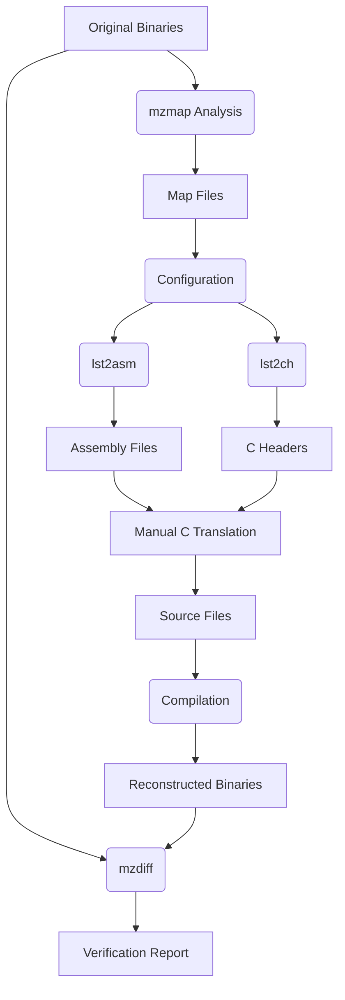

# F15 Strike Eagle II Reverse Engineering Guide

## Overview
This document outlines the reverse engineering workflow for the classic DOS game "F15 Strike Eagle II". The process leverages the mzretools suite to reconstruct the game binaries from original executables while maintaining binary equivalence.

## Tools Used
- **mzmap**: Identifies routines and creates symbol maps
- **mzdiff**: Verifies binary equivalence of reconstructed executables
- **lst2asm**: Generates assembly files from IDA Pro listings
- **lst2ch**: Creates C headers from IDA Pro listings
- **UASM**: Modern assembler for compiling assembly to binary
- **DOS Toolchain**: Original Microsoft C 5.1 compiler for authentic builds

## Workflow Steps

### 1. Binary Analysis
```bash
mzmap start.exe > start.map
mzmap egame.exe > egame.map
```

### 2. Configuration Setup
Create JSON configuration files:
- `conf/start_rc.json`
- `conf/egame_rc.json`

These define:
- Code/data segments
- Routine boundaries
- Data structures
- Memory mappings

### 3. Assembly Generation
```bash
./lst2asm.py start.lst src/start_rc.asm conf/start_rc.json
./lst2asm.py egame.lst src/egame_rc.asm conf/egame_rc.json
```

### 4. Header Generation
```bash
./lst2ch.py start.lst src conf/start_rc.json
./lst2ch.py egame.lst src conf/egame_rc.json
```

### 5. C Translation
Manual translation of assembly routines to C:
- `src/start0.c` - Main loader
- `src/start1.c` - Mission selection
- `src/egame0.c` - Core gameplay
- `src/egame1.c` - Graphics rendering

### 6. Building
```bash
make start  # Build start.exe
make egame  # Build egame.exe
make f15-se2 # Build main executable
```

### 7. Verification
```bash
make verify-start  # Verify start.exe
make verify-egame  # Verify egame.exe
```

### 8. Workflow Diagram


## Key Technical Concepts

### Binary Equality
Maintaining byte-for-byte equivalence requires:
- Precise segment alignment
- Matching data structure layouts
- Identical compiler optimizations
- Exact overlay loading sequences

### Memory Management
DOS memory models require special handling:
- Far pointers for segmented memory
- Overlay slot management
- EMS/XMS memory access

### Hardware Interaction
Original game uses:
- Direct hardware port access
- BIOS interrupts
- Custom graphics routines
- Joystick input handling

## Challenges & Solutions

| Challenge | Solution |
|-----------|----------|
| Compiler flag compatibility | Used original MSC 5.1 with custom build scripts |
| Linker errors | Modified dosbuild.sh to handle legacy linker flags |
| Data segment alignment | Created precise configuration files |
| Function parameter mismatches | Analyzed headers and call sites |

## Future Work
- Complete audio system reverse engineering
- Implement modern renderer while preserving gameplay
- Create modding tools for mission editing
- Port to modern platforms with SDL

## Resources
- [mzretools GitHub](https://github.com/mzre/tools)
- [UASM Assembler](https://github.com/Terraspace/UASM)
- [F15 SE2 Technical Reference](https://f15se2.re/docs)